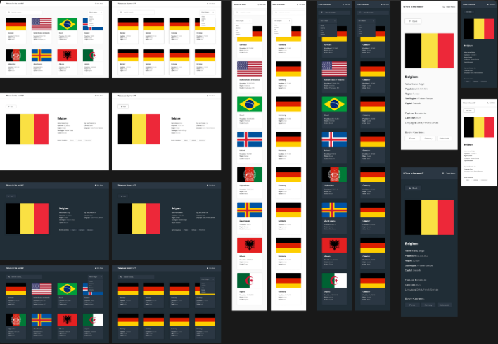

# Country List

My task is integrating with the [REST Countries API](https://restcountries.com/) to pull country data and display it like in the designs.

Your users should be able to:

- See all countries from the API on the homepage
- Search for a country using an `input` field
- Filter countries by region
- Click on a country to see more detailed information on a separate page
- Click through to the border countries on the detail page
- View the optimal layout for the interface depending on their device's screen size
- See hover and focus states for all interactive elements on the page

**Figma Design for the website**

## Stack

Summary of what the stack looks like now including a picture with the core tech:

* **Front-end** - Vite as the core framework, MaterialUI and Tailwind for UI, Redux for state management, Axios for request and response interception.

## Deployment

For this assigment, deployment web at Netlify :

[Netlify](https://app.netlify.com/)

[Deploy Website](https://assignment2-countrylist.netlify.app/)